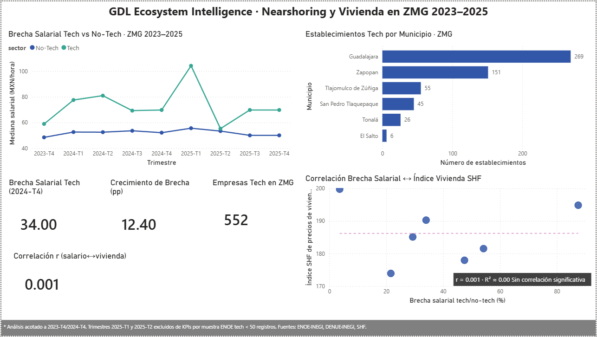

# GDL Ecosystem Intelligence
### Nearshoring, Brecha Salarial y Vivienda en la ZMG · 2023–2025


---

## Pregunta Central de Investigación

> ¿Ha generado el boom del nearshoring en Jalisco una brecha salarial entre
> trabajadores del sector tech y el resto de la economía, y está esa brecha
> correlacionada con el aumento en los precios de vivienda en la ZMG?

---

## Hallazgos Principales

| Hallazgo | Valor | Fuente |
|---|---|---|
| Brecha salarial tech vs no-tech (2024-T4) | **+34%** ($69.77 vs $52.08 MXN/hora) | ENOE · INEGI |
| Crecimiento de la brecha (2023-T4 → 2024-T4) | **+12.4 puntos porcentuales** | ENOE · INEGI |
| Establecimientos tech en ZMG | **552** (49% en Guadalajara) | DENUE · INEGI |
| Correlación brecha salarial ↔ índice vivienda SHF | **r = 0.001** (no significativa) | ENOE + SHF |

### Respuesta a la pregunta de investigación

**Sí existe una brecha salarial** tech/no-tech documentada y creciente en la ZMG
durante el período de análisis (+34% en 2024-T4, creciendo +12.4 pp desde 2023-T4).

**Sin embargo, no se encontró correlación** entre esa brecha y el índice de precios
de vivienda SHF (r = 0.001). Los precios de vivienda en la ZMG muestran una
trayectoria independiente de la evolución salarial del sector tech en el período analizado.

---

## Dashboard



---

## Estructura del Repositorio

```
gdl-ecosystem-intelligence/
├── data/
│   ├── raw/                    # Datos originales sin modificar
│   │   ├── enoe/               # Microdatos ENOE 2023-T4 a 2025-T4
│   │   └── vivienda/           # Índice SHF ZMG
│   └── processed/              # CSVs limpios para análisis
│       ├── enoe_brecha_salarial_zmg.csv
│       ├── denue_tech_zmg.csv
│       └── correlacion_salario_vivienda.csv
├── notebooks/
│   ├── 01_eda_enoe.ipynb       # EDA salarios y empleo
│   ├── 02_eda_denue.ipynb      # EDA establecimientos tech
│   └── 04_correlacion_vivienda.ipynb
├── src/ingestion/
│   ├── enoe_loader.py
│   └── denue_loader.py
├── reports/
│   ├── figures/                # Visualizaciones generadas
│   └── GDL_Ecosystem_Intelligence_Dashboard.pdf
└── docs/fuentes.md
```

---

## Reproducibilidad

```bash
# Clonar el repositorio
git clone https://github.com/emmysouza11-DC/gdl-ecosystem-intelligence

# Instalar dependencias
pip install -r requirements.txt

# Ejecutar notebooks en orden
jupyter notebook notebooks/01_eda_enoe.ipynb
jupyter notebook notebooks/02_eda_denue.ipynb
jupyter notebook notebooks/04_correlacion_vivienda.ipynb
```

Cada notebook corre de principio a fin con un solo **Run All**.

---

## Limitaciones y Trabajo Futuro

- Muestra ENOE sector tech < 50 registros en 2025-T1 y 2025-T2 — KPIs acotados a 2023-T4/2024-T4
- Se recomienda complementar con microdatos IMSS para mayor robustez
- Correlación con vivienda requiere series más largas (5+ años) para conclusiones definitivas
- Módulos IED Jalisco y ANUIES egresados pendientes de integración

---

## Stack Tecnológico

| Herramienta | Uso |
|---|---|
| Python 3.11 · pandas · matplotlib · seaborn | ETL y análisis exploratorio |
| geopandas | Visualización geoespacial |
| Jupyter Notebooks | Análisis reproducible |
| Power BI Desktop | Dashboard ejecutivo |
| Claude Code | Asistencia en desarrollo |
| GitHub | Control de versiones |

---

## Fuentes de Datos

| Fuente | Dataset | Acceso |
|---|---|---|
| INEGI — ENOE | Encuesta Nacional de Ocupación y Empleo | [inegi.org.mx](https://www.inegi.org.mx) |
| INEGI — DENUE | Directorio Estadístico Nacional de Unidades Económicas | API pública |
| SHF | Índice de Precios de Vivienda ZMG | [gob.mx/shf](https://www.gob.mx/shf) |

---

## Autor

**Emmanuel** · Data Science Portfolio
[GitHub](https://github.com/emmysouza11-DC) · Guadalajara, Jalisco · 2025

---

*Proyecto desarrollado como parte de un portafolio profesional en Data Science.*
*Datos públicos · Uso educativo y de investigación.*
